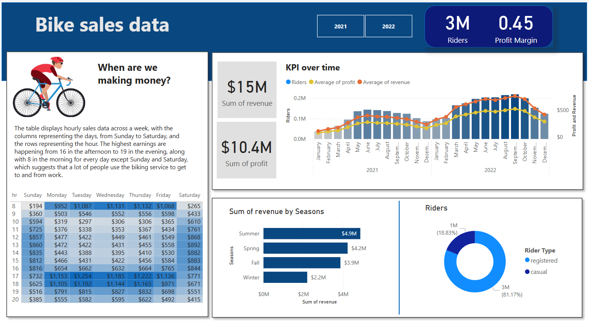

PROJECT - BIKE SALES from X company

In this project we will create a dashboard in Power BI, hosting a SQL server and database where we will pull data into Power BI from, and answer the question of where and when the company gets their money from. 

STEP 1 = Create a database on SQL Server Management System and import the CSV files necessary to perform the dashboard creation. In this situation it was 3 files, 2 of them being year dependent sales, while the last one was a price table. 

STEP 2 = Use a CTE to union together the dataset from 2021 to the dataset from 2022, then JOIN the cost table onto the CTE, based on the year. In addition, create the column revenue by multiplying riders and price, and the column profit by multiplying riders and price minus COGS and riders. 

	WITH cte as (
	SELECT * 
	FROM bike_share_yr_0
	UNION 
	SELECT * 
	FROM bike_share_yr_1)

	SELECT dteday, season, cte.yr, weekday, rider_type, riders, ROUND(price,2) as price, ROUND(COGS,2) as COGS, 
	ROUND(riders*price,2) as revenue,
	ROUND(riders*price-COGS*riders,2) as profit
	FROM cte
	LEFT JOIN cost_table ON cte.yr = cost_table.yr

STEP 3 = Start up Power BI and import the data from the SQL server, but using the code above as the statement, so we get exactly the data we need. 

STEP 4 = Start creating the dashboard by making the backgrounds and the squares that we are going to feature data on. 

STEP 5 = Create a Line and Clustered Column visual portraying Riders by Year and Month, but also with two lines showing the average Profit and average Revenue per Month and Year.

STEP 6 = Then create two Card visuals showing the Sum of Revenue and the Sum of Profit.

STEP 7 = We then create the Matrix visual on the left side, where the Rows are the Hours of the Day, and the Columns are the Weekdays, showing us the Revenue on separate times of days during the week. 

STEP 8 = Create a Bar visual showing the Sum of Revenue by Seasons, as well as a Pie visual showing the sum of registered Rider Types. 

STEP 9 = Use a measure to create a Profit Margin Card visual, by doing : 

	Profit Margin = (SUM(Query1[revenue])-SUM(Query1[profit]))/SUM(Query1[profit])

STEP 10 = Create a Slicer on the Year, to create a more interactive experience for the users. 

INSIGHTS - 

On the Line and Clustered Column visual we can see that the Revenue, Riders and Profit got a massive boost from 2021, and that in both years the amount of bikers surged during May to October. This is further pushed by the Bar visual showing us that the Summer season brings in the most Revenue by $4.9M, with Spring and Fall right behind at $4.2M and $3.9M respectively, while Winter is at a weak $2.2M. The Matrix visual on our left also shows us that the Revenue spikes during early morning at 8 am, and after 16 in the afternoon during Monday through Friday, suggesting that a vast majority of the bikers use them to get to and from work. As well as a notable amount of Revenue during midday on both Saturday and Sunday. With using the Slicer we can see that the Revenue and Profit doubled in 2022 compared to 2021, meaning that the company is growing notably. 

To summarize, to answer the question of "When are we making money?" is during Spring, Summer and Fall, especially right before and after work. In terms of growing the company even further, I would advice the company to run a survey to figure out how many of their members use their bikes to get to and from work, as this can be capitalized on, especially on the marketing front. 
